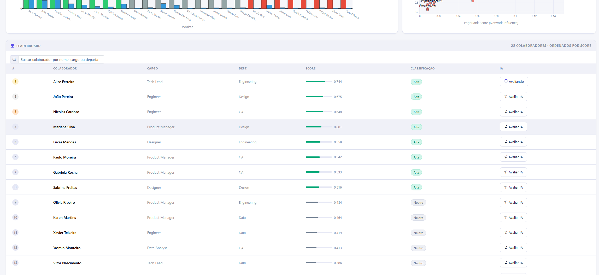
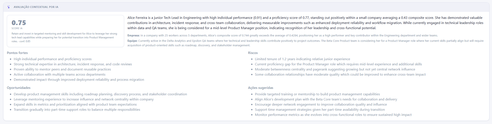
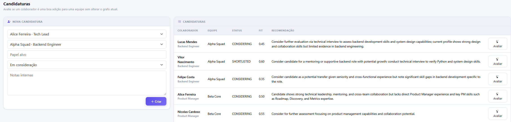

# Relationship Hypergraph System (RHPG)

Sistema de análise de performance organizacional baseado em grafos e hipergrafos. O RHPG combina indicadores individuais, relações de colaboração, participação em grupos/projetos e métricas estruturais de rede para classificar colaboradores em **alta**, **neutra** ou **baixa performance**.

O objetivo do projeto é oferecer uma leitura mais contextual da performance: em vez de avaliar uma pessoa apenas por KPIs isolados, o sistema considera também como ela se conecta, colabora, contribui para seus grupos e se encaixa em novas equipes. A aplicação também pode usar IA para analisar currículo, histórico, contexto de equipe e contexto da empresa como apoio à tomada de decisão humana.

## Demonstração

### Dashboard



O dashboard concentra a leitura principal da análise. Ele apresenta a quantidade total de colaboradores, a distribuição entre alta, neutra e baixa performance, gráficos comparativos de score e um leaderboard ordenado pelo composite score.

A Leaderboard permite buscar colaboradores por nome, cargo ou departamento e solicitar uma avaliação contextual por IA para um funcionário específico. Essa avaliação considera currículo, projetos, indicadores, relações, equipes atuais e candidaturas em andamento.

### Avaliação Contextual por IA



A avaliação contextual por IA não altera o score oficial do sistema. Ela funciona como um parecer separado, estruturado em resumo, recomendação, nível de confiança, pontos fortes, riscos, oportunidades de crescimento e ações sugeridas.

Essa análise é útil quando alguém quer entender não apenas “qual é o score”, mas como o funcionário aparece dentro do contexto da empresa e das equipes com que se relaciona.

### Candidaturas e Encaixe em Equipe



A tela de candidaturas permite indicar que um colaborador está sendo cogitado para uma equipe sem adicioná-lo imediatamente ao grupo. Isso evita contaminar o grafo e o score antes da decisão.

Para cada candidatura, o sistema pode solicitar uma avaliação de encaixe com IA. O resultado inclui fit score, recomendação, confiança, pontos fortes, riscos, aderências de skills, lacunas e perguntas sugeridas para entrevista ou conversa interna.

### Rede de Relacionamentos

<video src="img/network.mp4" controls width="100%">
  Seu navegador não conseguiu exibir o vídeo. Abra o arquivo em img/network.mp4.
</video>

A rede mostra como os colaboradores se conectam por relações de colaboração. Os nós são coloridos pela classificação de performance, as arestas indicam a força das relações e os filtros por grupo ajudam a investigar partes específicas da organização.

### Hipergrafo de Grupos

<video src="img/hipernetwork.mp4" controls width="100%">
  Seu navegador não conseguiu exibir o vídeo. Abra o arquivo em img/hipernetwork.mp4.
</video>

O hipergrafo destaca a participação dos colaboradores em grupos e projetos. Essa visão é útil para observar pertencimento, sobreposição entre grupos e colaboradores que atuam como conexão entre diferentes contextos de trabalho.

## O Que o Sistema Oferece

- **Dashboard executivo** com resumo de colaboradores, distribuição por classe de performance, leaderboard e gráficos Plotly.
- **Busca na Leaderboard** por nome, cargo ou departamento.
- **Avaliação contextual por IA** para analisar um funcionário no contexto da empresa, das equipes e da rede de relações.
- **Rede interativa de relacionamentos** com zoom, arraste, filtros por grupo, tooltips e arestas ponderadas.
- **Hipergrafo interativo de grupos** representando grupos/projetos como hiperestruturas conectadas aos seus membros.
- **Cadastro enriquecido de colaboradores** com currículo, skills, formação, certificações, idiomas, projetos, conquistas e links.
- **Upload opcional de currículo em PDF**, com extração de texto para apoiar a avaliação.
- **Candidaturas funcionário-equipe** para analisar possíveis movimentações ou alocações sem alterar memberships reais.
- **Avaliação de fit com IA** para medir aderência entre colaborador e equipe usando dados estruturados e contexto.
- **Classificação de performance** baseada em score composto configurável.
- **Análise de impacto por grupo**, incluindo delta score para medir quanto cada colaborador melhora ou reduz a qualidade de um grupo.
- **Métricas de centralidade** com NetworkX, incluindo PageRank e betweenness.
- **API REST com FastAPI** para cadastro, consulta, análise e visualização.
- **Persistência em SQLite** via SQLAlchemy.
- **Testes automatizados** com pytest.

## Como o Score é Calculado

O RHPG calcula um **composite score** para cada colaborador. Esse score combina seis dimensões:

| Métrica | Peso padrão | Interpretação |
|---|---:|---|
| Performance individual | 30% | Resultado individual informado para o colaborador. |
| Proficiência | 15% | Nível de habilidade ou domínio técnico/funcional. |
| PageRank | 20% | Influência do colaborador dentro da rede de colaboração. |
| Betweenness | 10% | Capacidade de atuar como ponte entre partes da rede. |
| Afinidade média | 10% | Grau de integração do colaborador com os grupos dos quais participa. |
| Delta score médio | 15% | Impacto médio do colaborador na qualidade dos grupos. |

Em termos gerais:

```text
composite_score =
    0.30 * individual_performance
  + 0.15 * proficiency
  + 0.20 * normalized_pagerank
  + 0.10 * normalized_betweenness
  + 0.10 * mean_affinity
  + 0.15 * normalized_mean_delta
```

As métricas de centralidade são normalizadas para a escala `[0, 1]`. O delta médio é deslocado com:

```text
normalized_mean_delta = clamp((mean_delta + 1) / 2, 0, 1)
```

### Delta Score

O delta score mede a variação relativa na qualidade de um grupo quando um colaborador participa dele:

```text
delta(worker, group) =
    (quality_with_worker - quality_without_worker) / quality_without_worker
```

A qualidade de um grupo é calculada por:

```text
group_quality =
    0.35 * mean(member_individual_performance)
  + 0.30 * mean(intra_group_collaboration_quality)
  + 0.20 * project_outcome_score
  + 0.15 * baseline_work_quality
```

Um delta positivo indica que o colaborador aumenta a qualidade estimada do grupo. Um delta negativo indica que a qualidade estimada cai quando ele é considerado.

### Afinidade

A afinidade mede o quanto um colaborador está integrado ao grupo:

```text
affinity(worker, group) =
    edge_density * mean_collaboration_quality * tenure_bonus
```

Onde:

```text
edge_density = conexões do colaborador com outros membros / (tamanho_do_grupo - 1)
tenure_bonus = min(1.0, tenure_years / 5.0)
```

### Classificação Final

Por padrão, o sistema usa percentis:

| Classe | Regra padrão |
|---|---|
| `HIGH` | Score acima ou igual ao percentil 70. |
| `NEUTRAL` | Score entre os percentis 30 e 70. |
| `LOW` | Score abaixo ou igual ao percentil 30. |

Também é possível reclassificar usando thresholds fixos ou K-Means pela rota `/analysis/classify`.

## Arquitetura

```text
Relationship-RHPG/
├── rhpg/
│   ├── api/              # FastAPI, routers e dependências
│   ├── algorithms/       # Delta score, afinidade, centralidade e classificação
│   ├── graph/            # NetworkX DiGraph e HyperNetX Hypergraph
│   ├── models/           # Dataclasses e schemas Pydantic
│   ├── services/         # Integrações de IA e avaliadores contextuais
│   ├── storage/          # SQLite, SQLAlchemy, repositórios e seed
│   ├── templates/        # Interface web renderizada com Jinja2
│   └── visualization/    # PyVis e Plotly
├── img/                  # Imagens e vídeos de demonstração
├── tests/                # Testes automatizados
├── data/                 # Bancos SQLite gerados localmente
├── requirements.txt
└── pyproject.toml
```

## Tecnologias

| Tecnologia | Uso |
|---|---|
| FastAPI | API REST e aplicação web. |
| SQLAlchemy | ORM e persistência em SQLite. |
| Pydantic | Validação dos schemas da API. |
| NetworkX | Grafo de colaboração e métricas de centralidade. |
| HyperNetX | Modelagem conceitual do hipergrafo de grupos. |
| OpenAI API | Avaliação contextual de colaboradores e fit com equipes. |
| PyVis | Visualizações interativas da rede e do hipergrafo. |
| Plotly | Gráficos da dashboard. |
| pandas / numpy | Normalização e manipulação de scores. |
| scikit-learn | Classificação alternativa por K-Means. |
| pypdf | Extração de texto de currículos em PDF. |
| pytest | Testes automatizados. |

## Instalação

Pré-requisitos:

- Python 3.11 ou superior.
- Ambiente virtual recomendado.

```bash
python -m venv .venv
```

Ative o ambiente virtual:

```bash
# Windows
.venv\Scripts\activate

# Linux/macOS
source .venv/bin/activate
```

Instale as dependências:

```bash
pip install -r requirements.txt
```

## Como Utilizar

### 1. Popular o banco com dados de exemplo

```bash
python -m rhpg.storage.seed
```

Esse comando cria colaboradores, grupos e relações sintéticas para demonstrar o funcionamento do sistema.

O seed também popula perfis enriquecidos, requisitos das equipes e candidaturas de exemplo:

- 25 colaboradores com currículo sintético, skills, projetos, formação e conquistas.
- 5 equipes com cargo aberto, senioridade desejada, skills e responsabilidades.
- Relações de colaboração intra-grupo e cross-group.
- Candidaturas funcionário-equipe para testar avaliação de fit.

### 2. Iniciar a aplicação

```bash
uvicorn rhpg.api.main:app --reload
```

Acesse:

- Dashboard: `http://localhost:8000/dashboard`
- Colaboradores: `http://localhost:8000/dashboard/workers`
- Candidaturas: `http://localhost:8000/dashboard/candidates`
- Equipes: `http://localhost:8000/dashboard/groups`
- Rede interativa: `http://localhost:8000/dashboard/network`
- Hipergrafo interativo: `http://localhost:8000/dashboard/hypergraph`
- Documentação Swagger: `http://localhost:8000/docs`

### 3. Executar a análise

Na interface, clique em **Executar Análise** no dashboard.

### 4. Rodar os testes

```bash
python -m pytest
```

## Variáveis de Ambiente

| Variável | Valor padrão | Descrição |
|---|---|---|
| `RHPG_DATABASE_URL` | `sqlite:///./data/rhpg.db` | URL de conexão com o banco de dados. |
| `OPENAI_API_KEY` | — | Chave usada para avaliações com IA. Recomenda-se configurar em `.env.local`. |
| `OPENAI_MODEL` | `gpt-4.1-mini` | Modelo usado nas avaliações contextuais e de fit. |

Exemplo de `.env.local`:

```env
OPENAI_API_KEY=sk-...
OPENAI_MODEL=gpt-4.1-mini
```

## API

Além da interface web, o projeto expõe uma API REST com FastAPI para cadastro de colaboradores, grupos, relações, execução da análise e acesso aos resultados.

Com a aplicação rodando, a documentação interativa da API pode ser acessada em:

```text
http://localhost:8000/docs
```

Nessa página é possível consultar os endpoints disponíveis, testar requisições e visualizar os schemas esperados.

## Pipeline de Análise

Ao executar `/analysis/run`, o sistema:

1. Carrega colaboradores, grupos, memberships e relações.
2. Constrói o grafo de colaboração com NetworkX.
3. Constrói o hipergrafo de grupos.
4. Calcula centralidades da rede.
5. Calcula delta score por colaborador e grupo.
6. Calcula afinidade entre colaboradores e grupos.
7. Normaliza métricas estruturais.
8. Calcula o composite score.
9. Classifica colaboradores como `HIGH`, `NEUTRAL` ou `LOW`.
10. Persiste os resultados no banco.

## Avaliações com IA

As avaliações com IA são sinais separados do score principal.

### Fit Funcionário-Equipe

Disponível na tela de **Candidaturas**. A análise considera:

- currículo, skills e projetos do colaborador;
- score atual e classificação;
- requisitos da equipe;
- cargo alvo, senioridade, responsabilidades e notas;
- riscos e lacunas de skill.

O resultado traz `fit_score`, recomendação, confiança, pontos fortes, riscos, gaps e perguntas sugeridas.

### Avaliação Contextual do Funcionário

Disponível na **Dashboard**, a partir da Leaderboard. A análise considera:

- dados do colaborador;
- currículo e histórico de projetos;
- score, PageRank, betweenness e classificação;
- equipes atuais;
- equipes em que o colaborador está sendo cogitado;
- relações diretas na rede;
- contexto agregado da empresa.

O resultado traz um parecer estruturado para apoiar conversas de gestão, desenvolvimento, mobilidade interna e planejamento de equipe.

## Observações

- Os scores de entrada devem estar no intervalo `[0, 1]`.
- O banco SQLite local é criado automaticamente na pasta `data/`.
- Os dados gerados pelo seed são sintéticos e servem apenas para demonstração.
- A classificação padrão é relativa à população analisada, pois usa percentis.
- As avaliações com IA não substituem decisão humana e não alteram o `composite_score`.
